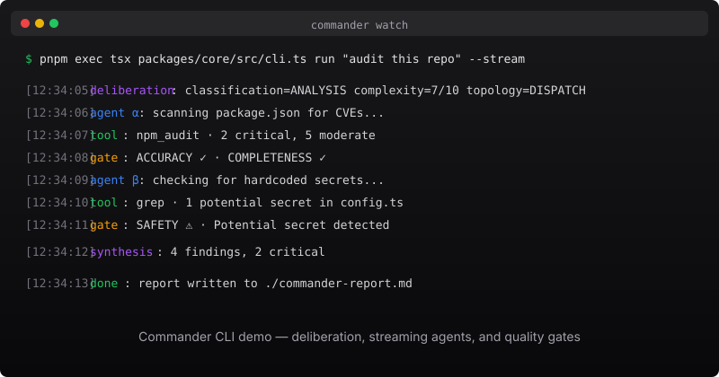

<p align="center">
  
  
  
  
</p>

<h1 align="center">Commander</h1>
<p align="center"><strong>AI が何をしているか見えるように。結果を確認。コストを削減。</strong></p>

> **Alpha 注意:** Commander は現在 alpha で、プロダクション対応ではありません。出力、ベンチマーク、POC
> シナリオ、ダッシュボード値は開発またはデモ用の信号です。独自の確認なしに、無人の本番ワークロードや機密データに使用しないでください。

<p align="center">
  <code>pnpm exec tsx packages/core/src/cliEntry.ts watch "investigate this bug"</code><br>
  <sub>インストール不要。ワンコマンド。マルチエージェントのイベントとツール呼び出しをリアルタイムでターミナルに表示。</sub>
</p>

<p align="center">
  
</p>

---

> **2 つの実行形態：** Commander は 2 つの SKU で提供されます —— **Local CLI**（ローカルツール、デフォルト）と **Enterprise Gateway**（`/v1` + 任意 Postgres、**alpha**。live-fire 証明済みの完全マルチテナント SaaS ではありません）。詳細は英語の [README.md](README.md) SKU 表と [ENTERPRISE_READINESS.md](ENTERPRISE_READINESS.md) を参照。

## Commander の独自性

**透明性——実行イベントを確認。** 各エージェントのイベント、ツール呼び出し、利用可能なゲート決定が SSE を介してリアルタイムでストリーミングされます。出力された作業トレースを段階的に確認できます。

**信頼性——設定可能な出力チェック。** 検証パイプラインを有効にした経路では、品質ゲートが結果を返す前に設定済みのチェックを実行します。ハルシネーション検出、整合性、完全性、正確性、安全性を含み、失敗時は再試行または失敗を報告します。

**コスト効率——スマートな支出。** 推論エンジンがトークンを消費する前にタスクを分析します。適切なトポロジを自動選択——単純なタスクには 1 エージェント、複雑なタスクには並列エージェント。実際のコストはプロバイダー、モデル、タスク、設定した検証によって異なります。

**25 の LLM プロバイダー。** OpenAI、Anthropic、Google、Azure、DeepSeek、GLM、MiMo、Xiaomi、Groq、Together、Perplexity、Fireworks、Replicate、Mistral、Cohere、OpenRouter、xAI、Anyscale、DeepInfra、Agnes、Ollama、vLLM、AWS Bedrock、StepFun、MiniMax——環境変数を 1 つ設定するだけで、Commander が残りを処理します。フォールバックチェーン付き。

**自己改善。** Meta-learner は Thompson Sampling + Reflexion を使用して、記録された実行に基づきエージェント設定を調整します。効果はタスク、モデル、データに依存します。

---

## 30 秒デモ

```bash
# tsx があればインストール不要（または pnpm/npx を使用）
pnpm exec tsx packages/core/src/cliEntry.ts watch "find the bug in src/server.ts and fix it"
```

これは UI を示す録画デモで、CLI の SSE ストリーミング操作を紹介します。プロダクション実行や顧客環境の証拠を示すものではありません。

---

## 30 秒でわかる仕組み

```bash
# 1. インストール
pnpm install

# 2. API キーを設定（25 プロバイダーから自動検出）
export OPENAI_API_KEY=sk-...

# 3. 何でも実行
pnpm exec tsx packages/core/src/cliEntry.ts run "analyze this repository"
pnpm exec tsx packages/core/src/cliEntry.ts plan "implement authentication"    # 実行前に計画を確認
pnpm exec tsx packages/core/src/cliEntry.ts watch "debug the failing test"     # エージェントのイベントをリアルタイム表示
```

---

## Commander と他のフレームワークの比較

|                               | Commander             | LangGraph         | CrewAI          | AutoGen                     |
| ----------------------------- | --------------------- | ----------------- | --------------- | --------------------------- |
| **ライブ SSE ストリーミング** | ✅ 組み込み           | ❌                | ❌              | ❌                          |
| **自動トポロジ選択**          | ✅ 5 トポロジ         | ❌ 手動グラフ構築 | ❌ 固定順序実行 | ❌ 手動オーケストレーション |
| **品質ゲート**                | ✅ 多層検証           | ❌                | ❌              | ❌                          |
| **ハルシネーション検出**      | ✅ 組み込み           | ❌                | ❌              | ❌                          |
| **推論エンジン**              | ✅ スマートタスク分析 | ❌                | ❌              | ❌                          |
| **Meta-learner**              | ✅ 自動チューニング   | ❌                | ❌              | ❌                          |
| **プロバイダー数**            | ✅ 25                 | ❌ 1-2            | ❌ 1-2          | ❌ 1-2                      |
| **CLI エクスペリエンス**      | ✅ 36 コマンド        | ❌ API のみ       | ❌ API のみ     | ❌ API のみ                 |
| **Web GUI**                   | ✅ Agent War Room     | ❌                | ❌              | ❌                          |
| **TUI ダッシュボード**        | ✅ ターミナル UI      | ❌                | ❌              | ❌                          |

---

## トポロジ

Commander は 5 つの標準トポロジから適切な構成を自動選択します：

- **SINGLE** — 単一エージェント、単純なクエリ、迅速な回答
- **CHAIN** — 順次パイプライン、段階的な精緻化
- **DISPATCH** — 複数の独立したサブタスクを並列分派
- **ORCHESTRATOR** — オーケストレーターが複数のサブエージェントを調整（再帰的分解含む）
- **REVIEW** — 生成後にレビューエージェントで検証

（下位互換のため 9 個のレガシー別名も保持。）

---

## アーキテクチャ

```
packages/core/src/
├── ultimate/          # オーケストレーションエンジン（deliberation / topologyRouter / atomizer / synthesizer / qualityGates）
├── runtime/           # 実行エンジン（agentRuntime / modelRouter / providers / messageBus / saga 統合）
├── security/          # セキュリティサブシステム（ゼロトラスト / 監査チェーン / レッドチーム / コンプライアンス）
├── tools/             # 組み込みツール（createAllTools、既定で 18 個を登録）
├── memory/            # 3 層メモリ（working / episodic / long-term）
├── mcp/               # Model Context Protocol + A2A
├── saga/              # 永続的補償トランザクション
├── selfEvolution/     # Meta-learning（Thompson Sampling + Reflexion）
├── sandbox/           # サンドボックス（TEE / seccomp / ネットワークプロキシ）
└── ... その他のコアモジュール
```

---

## 品質ゲート

検証パイプラインを有効にした経路では、結果は返却前に設定済みのチェックを通ります：

```
タスク入力 → エージェント実行 → [品質ゲート] → 設定済みチェック後の出力
                            │
                            ├─ ハルシネーション検出（hallucination）
                            ├─ 整合性（consistency）
                            ├─ 完全性（completeness）
                            ├─ 正確性（accuracy）
                            └─ 安全性（safety）
```

---

## はじめに

### 前提条件

- Node.js ≥ 18
- pnpm（推奨）または npm
- 任意の LLM プロバイダーの API キー

### インストール

```bash
git clone https://github.com/PStarH/Commander.git
cd Commander
pnpm install
```

### 設定

```bash
# サンプル環境ファイルをコピー
cp .env.example .env

# 少なくとも 1 つの API キーを設定
export OPENAI_API_KEY=sk-...
# または
export ANTHROPIC_API_KEY=sk-ant-...
```

### 実行

```bash
# CLI を使用
pnpm exec tsx packages/core/src/cliEntry.ts run "your task here"

# 基本例を実行
pnpm exec tsx examples/basic.ts

# Docker を使用
docker compose up -d
```

---

## ベンチマーク

> 以下のベンチマークはシミュレーション/スクリプト化 harness または CI ベースラインで実行されます。プロダクション SLA や SOC 証拠を測るものではありません。

```bash
pnpm benchmark:gaia        # GAIA ベンチマークを実行（詳細なスクリプトは package.json の scripts を参照）
```

---

| スイート | カバレッジ | 結果 |
| -------- | ---------- | ---- |
| Chaos Engineering | 合成 200 ケース + mutation 55 ケース（計 255） | harness の入口；結果は基準マトリクスを参照 |
| Red Team | 47 シナリオ、8 攻撃カテゴリ | 掲載ケースはすべて blocked（シミュレーション harness） |
| AgentDojo | 12 セキュリティテストケース | 掲載ケースはすべて blocked（シミュレーション harness） |
| GAIA Spine | コア機能ベンチマーク | quick/offline 回帰をスケジュール；完全な fixture は保留 |
| SLO | API 可用性 99.95%、P95 スケジュール <5s | CI ベースライン、プロダクション SLA ではない |

```bash
# 任意のベンチマークを再現
pnpm test:core                   # コアスイートとローカルベースラインを検証
pnpm test:core                   # 完全なコアスイート：node:test + vitest
pnpm benchmark:chaos:full        # カオスエンジニアリングベンチマーク（255 シナリオ）
```

---

## コマンド

| コマンド                           | 機能説明                                                    |
| ---------------------------------- | ----------------------------------------------------------- |
| `commander run <task>`             | 完全なマルチエージェント実行（`--dry-run` で計画表示、`--stream` でリアルタイム SSE、`--tui` で端末ダッシュボード） |
| `commander fix`                    | lint・フォーマット・型エラーを自動修正                      |
| `commander init`                   | ゼロ設定環境スキャン + プロバイダー接続テスト               |
| `commander company <task>`         | ローカル company モード：計画 → 構築 → レビュー → 改善 |
| `commander swarm <task>`           | 再帰的分解 + 並列実行                                       |
| `commander drive <task>`           | 自律的な段階的実行                                          |
| `commander goal <task>`            | 多輪収束ループ                                              |
| `commander review`                 | P0-P3 の構造化コードレビュー                                |
| `commander status`                 | システムステータス、プロバイダー正常性、MetaLearner 統計    |
| `commander config`                 | 設定の表示または変更                                        |
| `commander doctor`                 | 診断を実行                                                  |
| `commander history`                | セッション管理                                              |
| `commander gui`                    | Web ダッシュボード（Agent War Room）                        |
| `commander skill`                  | 学習可能スキル管理                                          |
| `commander plugin`                 | プラグインのインストール/一覧/アンインストール               |
| `commander mode`                   | 承認モードの表示または設定                                   |
| `commander feedback`               | フィードバックの送信                                        |
| `commander budget`                 | トークンバジェット状況の表示                                 |
| `commander checkpoint`             | チェックポイント文書の表示                                   |
| `commander saga`                   | Saga トランザクション管理                                    |
| `commander cost`                   | トークン使用量とコストレポート                               |

---

## API 使用

CLI または `@commander/core` の `Commander` エントリで使用します：

```bash
pnpm exec tsx packages/core/src/cliEntry.ts run "analyze this repository"
```

または HTTP API（`apps/api`、既定 `:4000`）および Web コンソール（`pnpm gui`）経由で統合できます。

---

## プロバイダー

環境変数を 1 つ設定するだけ。Commander が **25 プロバイダー**から自動検出します：

`OPENAI_API_KEY` · `AZURE_OPENAI_API_KEY` · `ANTHROPIC_API_KEY` · `GOOGLE_API_KEY` · `DEEPSEEK_API_KEY` · `ZHIPU_API_KEY` (GLM) · `MIMO_API_KEY` · `XIAOMI_API_KEY` · `GROQ_API_KEY` · `TOGETHER_API_KEY` · `PERPLEXITY_API_KEY` · `FIREWORKS_API_KEY` · `REPLICATE_API_TOKEN` · `MISTRAL_API_KEY` · `CO_API_KEY` · `OPENROUTER_API_KEY` · `OLLAMA_HOST` · `VLLM_BASE_URL` · `AWS_ACCESS_KEY_ID` (Bedrock) · `XAI_API_KEY` · `ANYSCALE_API_KEY` · `DEEPINFRA_API_KEY` · `AGNES_API_KEY` · `STEPFUN_API_KEY` · `MINIMAX_API_KEY`

---

## デプロイ

```bash
# ローカル（Docker Compose）
docker compose up -d
# → API: localhost:4000  |  Web GUI: localhost:3000

# 本番環境（VM / VPS）
./scripts/deploy-vm.sh your-vm-ip --env-file .env.production
```

本番 Compose オーバーレイで追加できるもの：CPU/メモリ制限、JSON ファイルログ、自動再起動、ヘルスチェック、レート制限。マルチテナンシーは **Enterprise Gateway（alpha）** —— リクエスト文脈の隔離はあり、ストレージ隔離は opt-in。`ENTERPRISE_READINESS.md` を参照し、完成形 SaaS 隔離とみなさないでください。

---

## CI/CD

`.github/workflows/ci.yml` — 品質チェック（型チェック + 完全なコアテストスイート + ベンチマーク + ビルド）+ Docker + Web GUI。`.github/workflows/cd.yml` で main ブランチに自動デプロイ。

---


## ドキュメント

- [ARCHITECTURE.md](ARCHITECTURE.md) — システム設計・モジュール図・データフロー
- [docs/getting-started.md](docs/getting-started.md) — クイックスタート
- [docs/deploy.md](docs/deploy.md) — デプロイ
- [docs/v2-migration-guide.md](docs/v2-migration-guide.md) — Architecture V2 移行
- [docs/slo.md](docs/slo.md) — SLO 定義
- [SECURITY.md](SECURITY.md) — セキュリティモデル・脅威モデル・コンプライアンス
- [BENCHMARK.md](BENCHMARK.md) — ベンチマーク行列と手法
- [CHANGELOG.md](CHANGELOG.md) — リリース履歴
- [docs/README.md](docs/README.md) — 公開ドキュメント索引

内部監査・AI 作業計画・デューデリジェンスメモは**本リポジトリに含まれません**。開発者ローカルの `.internal/`（gitignore）のみです。

## プライバシー、フィードバック、セキュリティ

- [PRIVACY.md](PRIVACY.md): provider への送信、trace/memory/audit の保存、保持と削除の境界。
- 通常のバグは [GitHub Issues](https://github.com/PStarH/Commander/issues) に、prompt・ログ・設定・PII・秘密情報を必ずマスキングして報告してください。
- 質問や提案は [GitHub Discussions](https://github.com/PStarH/Commander/discussions) を使用してください。
- セキュリティ脆弱性は [SECURITY.md](SECURITY.md) に従って非公開で報告し、公開 issue は作成しないでください。

## ライセンス

MIT

---

<p align="center">
  <sub>AI が実際に何をしているか見たい開発者のために ❤️ を込めて構築。</sub>
</p>
