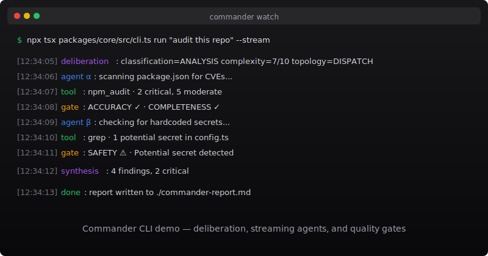

<p align="center">
  <a href="https://www.npmjs.com/package/@commander/core"></a>
  <a href="https://github.com/PStarH/Commander/actions/workflows/ci.yml"></a>
  
  
  
  
  <a href="https://github.com/PStarH/Commander/releases"></a>
</p>

<h1 align="center">Commander</h1>
<p align="center"><strong>Production-grade multi-agent orchestration.</strong></p>

<p align="center">
  <code>npx tsx packages/core/src/cli.ts run "audit this repo" --stream</code><br>
  <sub>Every agent thought streams to your terminal. Every output is verified. 25 providers. One command.</sub>
</p>

<p align="center">
  <a href="#quick-start"></a>
  <a href="https://github.com/PStarH/Commander/stargazers"></a>
  <a href="https://github.com/PStarH/commander-docs"></a>
</p>

<p align="center">
  
</p>

---

## What is Commander

Commander takes a task — any task — and automatically breaks it down, routes it to the right agents, and verifies every output.

- **Simple tasks** get one agent, one pass.
- **Research tasks** get parallel agents, then synthesis.
- **Complex engineering tasks** get a full pipeline: analysis → implementation → review → merge.

Every agent decision streams to you in real time. Every output passes through five quality gates before you see it. When a provider fails, the next one takes over. When an agent writes buggy code, the review agent catches it.

**No graph building. No YAML. No black boxes.**

---

## Quick Start

```bash
# Clone and install
git clone https://github.com/PStarH/Commander.git
cd Commander && pnpm install

# Set any API key — Commander auto-detects the provider
export OPENAI_API_KEY=sk-...
# or: ANTHROPIC_API_KEY / DEEPSEEK_API_KEY / GROQ_API_KEY / ...

# One-click Web Console (API + Web + auto-open browser)
pnpm gui

# Or run from the terminal
npx tsx packages/core/src/cli.ts run "audit this repo for security vulnerabilities"
npx tsx packages/core/src/cli.ts run "refactor the auth module" --dry-run
npx tsx packages/core/src/cli.ts run "explain the architecture" --stream
```

For Docker:

```bash
export COMMANDER_API_KEY="your-secret-key"
export OPENAI_API_KEY="sk-..."
docker compose up -d
```

API on `:4000`, Web on `:3000`.

---

## Key Features

### Deliberation Engine

Task classification, complexity estimation, and topology selection — all automatic. Commander classifies your task (CODING / RESEARCH / ANALYSIS / FACTUAL), estimates complexity, and picks from 5 canonical topologies: SINGLE, CHAIN, DISPATCH, ORCHESTRATOR, REVIEW. A one-line task uses 1 agent. A cross-repository audit spins up 20.

### Live Streaming

Every agent thought, every tool call, every quality gate decision — streamed to your terminal or SSE endpoint. Not polling. Not logs after the fact. You watch your agents reason, step by step.

```
┌─ Deliberation ──────────────────────────────────────────────┐
│ Task: "audit this repo for security issues"                  │
│ Classification: ANALYSIS · Complexity: 7/10                  │
│ Topology: DISPATCH (3 agents)                                │
├─ Agent α (security-scanner) ─────────────────────────────────┤
│ [think] Scanning package.json for known CVEs...              │
│ [tool] npm audit · 2 critical, 5 moderate                    │
│ [gate] ACCURACY ✓ · COMPLETENESS ✓                           │
├─ Agent β (code-reviewer) ────────────────────────────────────┤
│ [think] Checking for hardcoded secrets...                    │
│ [tool] grep · found 1 potential secret in config.ts          │
│ [gate] SAFETY ⚠ · Potential secret detected                  │
├─ Agent γ (dependency-checker) ───────────────────────────────┤
│ [think] Analyzing license compliance...                      │
│ [tool] license-check · No GPL/AGPL dependencies              │
│ [gate] COMPLETENESS ✓ · ACCURACY ✓                           │
├─ Synthesizer ────────────────────────────────────────────────┤
│ Merging 3 agent outputs...                                   │
│ Leader synthesis · 4 findings, 2 critical                    │
└──────────────────────────────────────────────────────────────┘
```

### 25 Providers with Auto-Failover

Set any one API key. Commander detects your provider, and if it fails, falls through a configurable chain. OpenAI → Anthropic → DeepSeek → Groq → Ollama — you define the order, Commander handles the routing.

OpenAI · Anthropic · Google · Azure · DeepSeek · GLM · MiMo · Xiaomi · Groq · Together · Perplexity · Fireworks · Replicate · Mistral · Cohere · OpenRouter · xAI · Anyscale · DeepInfra · Agnes · Ollama · vLLM · AWS Bedrock · StepFun · MiniMax

### Quality Gates on Every Output

Before returning any result, Commander runs 5-layer verification:

| Gate | What it checks |
|---|---|
| Hallucination | LLM-as-Judge detection of fabricated facts |
| Consistency | Cross-agent agreement, no contradictions |
| Completeness | All required dimensions covered |
| Accuracy | Factual correctness against source material |
| Safety | Content scanning, injection detection |

If the output fails any gate, the system retries or reports the failure with full context.

### Resilience

| Capability | Implementation |
|---|---|
| Circuit Breakers | 3-state (CLOSED/OPEN/HALF-OPEN), per-provider error rate tracking |
| Dead Letter Queue | Append-only NDJSON, 7 categories, replay support |
| Saga Compensation | Failed mutations → automatic rollback |
| Checkpointing | SQLite + WAL, crash-safe recovery (<5s target) |
| Semantic Caching | SHA-256 exact + cosine-similarity deduplication |

### Security

AES-256-GCM encrypted secrets vault. Tamper-proof audit chain. RBAC with capability tokens. ISO 42001 / NIST AI RMF compliance reporting. Red team framework (47 scenarios, 8 attack categories). Tenant isolation via AsyncLocalStorage.

### Self-Optimization

A meta-learner using Thompson Sampling and Reflexion tunes agent configurations across runs. It learns which topologies work best for which task types, which providers are fastest, and which parameter combinations produce the highest quality results. Activates after 5+ recorded runs.

---

## Architecture

```
                        ┌──────────────────────────────┐
                        │      DELIBERATION ENGINE      │
                        │  Task classification          │
                        │  Complexity estimation        │
                        │  Topology selection           │
                        └──────────┬───────────────────┘
                                   │
                        ┌──────────▼───────────────────┐
                        │       TOPOLOGY ROUTER          │
                        │  SINGLE · CHAIN · DISPATCH     │
                        │  ORCHESTRATOR · REVIEW          │
                        └──────────┬───────────────────┘
                                   │
               ┌───────────────────┼───────────────────┐
               ▼                   ▼                   ▼
        ┌──────────────┐   ┌──────────────┐   ┌──────────────┐
        │   AGENT 1    │   │   AGENT 2    │   │   AGENT N    │
        │  LLM → Tool  │   │  LLM → Tool  │   │  LLM → Tool  │
        │  → Verify    │   │  → Verify    │   │  → Verify    │
        └──────┬───────┘   └──────┬───────┘   └──────┬───────┘
               └──────────────────┼──────────────────┘
                                  ▼
                        ┌──────────────────────────────┐
                        │         SYNTHESIS              │
                        │  Merge · Resolve conflicts    │
                        └──────────┬───────────────────┘
                                   ▼
                        ┌──────────────────────────────┐
                        │       QUALITY GATES           │
                        │  Hallucination · Consistency  │
                        │  Completeness · Accuracy     │
                        │  Safety                      │
                        └──────────┬───────────────────┘
                                   ▼
                              RESULT
```

---

## Web Console

Commander includes a web-based control console for visual monitoring, chat-based agent interaction, and governance:

```bash
# One-click start (API on :4000 + Web on :5173 + auto-open browser)
pnpm gui
```

Open `http://localhost:5173`. The console provides:

- **Dashboard** — Battle report, token trends, live topology, agent roster, mission board
- **Chat** — Conversational interface with real-time agent streaming
- **Governance** — Approval queue, unified policy configuration, audit log
- **DLQ** — Dead letter queue management with replay
- **Security** — ISO 42001 / NIST AI RMF compliance posture
- **Execution** — Real-time execution feed with hallucination risk panel
- **Agents** — Agent roster with lineage tree visualization

---

## Reliability Targets

| Target | Goal | Mechanism |
|---|---|---|
| Checkpoint Recovery | <5s | SQLite + WAL |
| Provider Failover | <10s | Automatic fallback chain |
| Saga Compensation | <30s | Compensation scheduler |
| DLQ Processing | <60s | Append-only NDJSON, replay |

---

## Benchmarks

| Suite | Coverage | Result |
|---|---|---|
| Chaos Engineering | 255 synthetic + 55 mutation | 55.7% pass rate |
| Red Team | 47 scenarios, 8 attack categories | 100% defense |
| AgentDojo | 12 security test cases | 100% defense |
| RealWorld | 50 production-like cases | 96% pass rate |
| GAIA Spine | Core capability benchmark | Running daily |
| SLO | 99.5% API success, <2s p95 latency | Measured daily |

Full matrix: [BENCHMARK.md](BENCHMARK.md)

---

## Health Check

```bash
curl http://localhost:4000/health          # Basic
curl http://localhost:4000/health/detailed # All components
curl http://localhost:4000/readyz          # Kubernetes readiness
curl http://localhost:4000/metrics          # Prometheus
```

Monitors: memory, circuit breakers, DLQ size, checkpoint staleness, pending compensations, event bus backlog, provider availability, disk space.

---

## Why Commander

Existing agent frameworks treat you like a passenger. You write configuration, you wait, and you hope the output is correct. When it's wrong, you have no idea why.

Commander treats you like an **engineer**. You see every decision. You trust every result. You ship faster because you're not guessing what your AI is doing.

The system is built with the same discipline as any production distributed system: circuit breakers, dead letter queues, SSE streaming, semantic caching, and provider fallback chains. The only difference is that the workload is LLM calls instead of HTTP requests.

---

## Documentation

- [ARCHITECTURE.md](ARCHITECTURE.md) — System design, module map, data flow
- [ENTERPRISE_READINESS.md](ENTERPRISE_READINESS.md) — Production deployment checklist
- [SECURITY.md](SECURITY.md) — Security model, threat model, compliance
- [BENCHMARK.md](BENCHMARK.md) — Full benchmark matrix and methodology
- [CHANGELOG.md](CHANGELOG.md) — Release history

---

## License

MIT. See [LICENSE](LICENSE) and [COPYRIGHT.md](COPYRIGHT.md).

---

<p align="center">
  <sub>5 canonical topologies · 25 providers · 18 built-in tools · Built for engineers who want to see what their AI is actually doing.</sub>
</p>